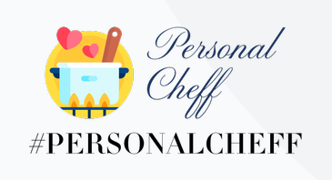

# <PersonalCheff>
<!---Esses são exemplos. Veja https://shields.io para outras pessoas ou para personalizar este conjunto de escudos. Você pode querer incluir dependências, status do projeto e informações de licença aqui--->


> Uma Aplicação web de receitas chamada PersonalCheff desenvolvida durante o Curso de Python no Senac Americana. A Aplicação listará receitas e clicando em cada nome de receitas você pode ver a receita Completa 

<APP para gerenciamento de Receitas>

### Lista de tarefas
Segue a lista de tarefas a serem desenvolvidas no projeto:
- [X] Pré-requisitos
    - [X] Instalar o Python
    - [X] Instalar Visual Studio Code
- [X] Criar e ativar o ambiente virtual

``` 
python -m venv.\venv\
venv\Scripts\activate
``` 
- [X] Instalar o Django
``` 
python -m pip install django==3.2 
```
- [X] Criar o projeto PersonalCheff
```
django-admin.py help
django-admin.py startproject PersonalCheffProj
```
- [X] Subir o servidor e testar o projeto
```
Entrar na Pasta do Projeto
cd PersonalCheffProj
executar o projeto no servidor
python manager.py runserver
```
- [X] Alterar o idioma do projeto para `pt-br`
```
Abri o Arquivo 'settings.py' e
Ir na Linha 106 = LANGUAGE_CODE = 'pt-br'
```
- [X] Alterar o timezone do projeto para `America/Sao_Paulo`
```
Abri o Arquivo 'settings.py' e
Ir na Linha 108 TIME_ZONE = 'America/Sao_Paulo'
```
- [X] Criar o app receitas
- [X] Registrar o app receitas
- [X] Configurar a rota inicial(index)
- [ ] Criar a view para a rota inicial
- [ ] Registrar a rota inicial
- [ ] Criar o arquivo index

## 📝 Licença
Esse projeto está sob licença. Veja o arquivo [LICENÇA](LICENSE.md) para mais detalhes.
[⬆ Voltar ao topo](#nome-do-projeto)<br>